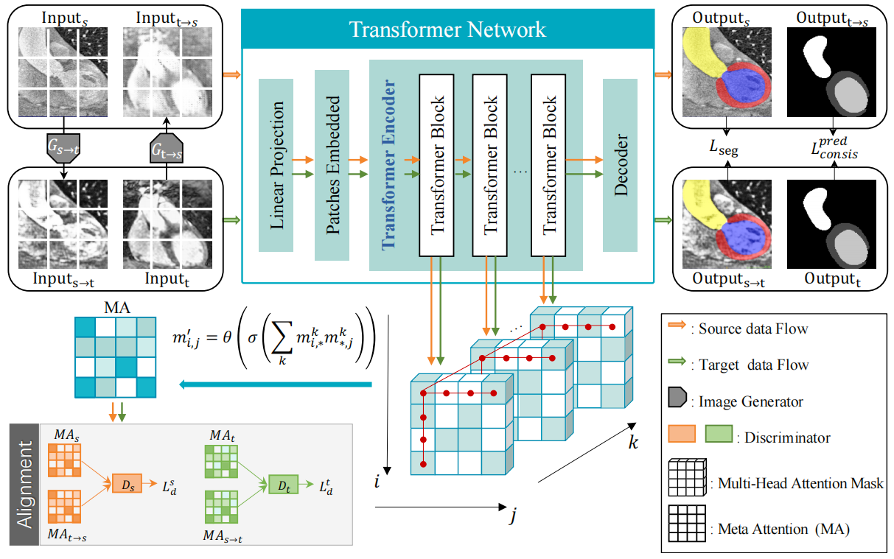

# Unsupervised Domain Adaptation for Medical Image Segmentation Using Transformer With Meta Attention


## Project Overview

This repository contains the pytorch implementation of our proposed Unsupervised Domain Adaptation (UDA) framework using Transformers for cross-modality medical image segmentation. 
You can access our paper on [Unsupervised Domain Adaptation for Medical Image Segmentation Using Transformer With Meta Attention](https://ieeexplore.ieee.org/abstract/document/10273225).



## Datasets

**MMWHS Dataset:** Multi-modality whole heart segmentation dataset.

We downloaded the dataset from [SIFA](https://github.com/cchen-cc/SIFA), and we keep data processing and dataset partitioning consistent with SIFA.


## Inference
Our trained models can be downloaded from [Google Drive](https://drive.google.com/drive/folders/1CEelN45sCQ1o1-Xnafp2e7pO9vA_BK4z?usp=sharing). 
1. Specify the model information in ./inference.py
2. Run ./inference.py to start the evaluation.

## Citation
If you find the code useful for your research, please cite our paper.
```bash
@article{ji2023unsupervised,
  title={Unsupervised domain adaptation for medical image segmentation using transformer with meta attention},
  author={Ji, Wen and Chung, Albert CS},
  journal={IEEE Transactions on Medical Imaging},
  year={2023},
  publisher={IEEE}
}
```

## Acknowledgement
Part of the code is revised from [Swin Transfomer](https://github.com/microsoft/Swin-Transformer).

## Note
Contact: Wen Ji (wjiac@connect.ust.hk)